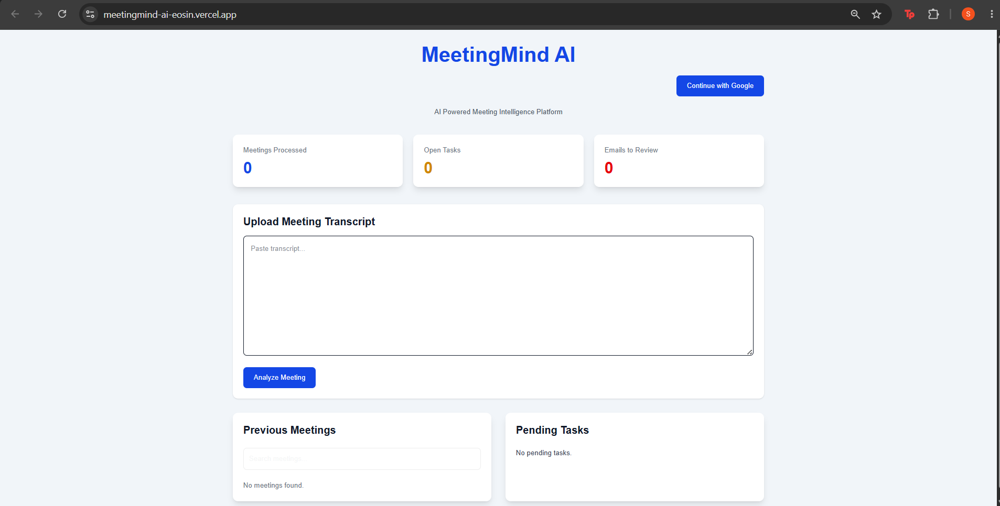
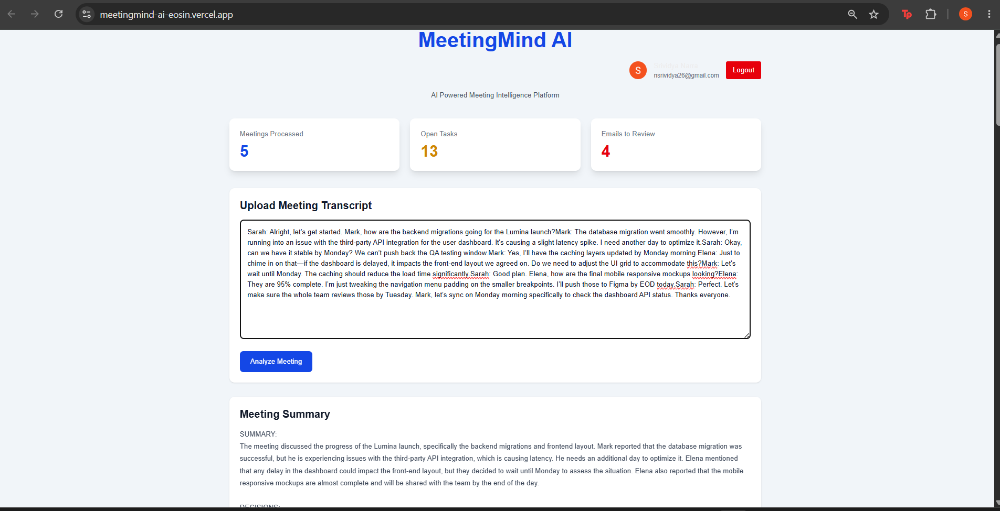
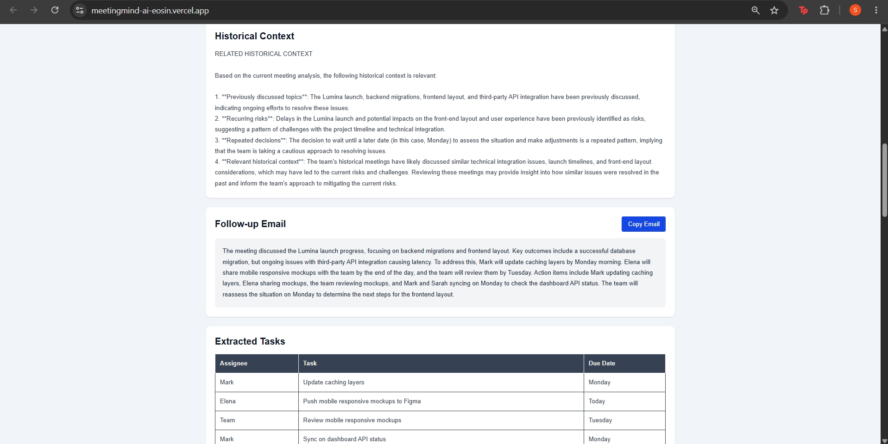
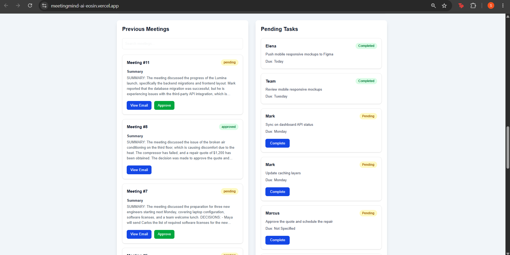

# 🧠 MeetingMind AI

<p align="center">

AI-powered Meeting Intelligence Platform built using <b>Next.js, FastAPI, LangGraph, Groq, Pinecone, Supabase, and Voyage AI</b>.

Automatically analyzes meeting transcripts, retrieves historical meeting context, extracts action items, generates professional follow-up emails, and manages meeting tasks through an intelligent workflow.

</p>

---

## 🚀 Live Demo

### 🌐 Frontend

https://meetingmind-ai-eosin.vercel.app

### ⚡ Backend API

Hosted on Render (used by the live demo)

---

# 📌 Project Overview

Organizations conduct numerous meetings every day, but important discussions, action items, and decisions often get lost.

**MeetingMind AI** is an intelligent meeting assistant that transforms raw meeting transcripts into actionable insights using Large Language Models (LLMs) and Retrieval-Augmented Generation (RAG).

Unlike traditional meeting assistants that summarize only the current meeting, MeetingMind AI retrieves semantically similar historical meetings to provide richer context during analysis.

The application also extracts tasks, generates professional follow-up emails, stores meeting history, and provides a centralized dashboard for meeting management.

---

# ✨ Features

* 🔐 Google Authentication using Supabase
* 🤖 AI-powered Meeting Analysis
* 🧠 Historical Context Retrieval using Pinecone Vector Search
* 📚 Semantic Organizational Memory
* ✅ Automatic Task Extraction
* 📧 AI-generated Follow-up Emails
* ✔️ Email Approval Workflow
* 📋 Meeting Dashboard
* 📌 Pending Task Tracking
* 📄 Download Professional PDF Reports
* ☁️ Cloud Deployment using Vercel and Render

---

# 🏗️ System Architecture

```text
                    User

                      │

              Next.js Frontend

                      │

             FastAPI REST Backend

                      │

               LangGraph Workflow

      ┌───────────────┼────────────────┐

      │               │                │

 Groq LLM       Pinecone Vector DB   Supabase

      │               │                │

      └───────────────┼────────────────┘

                      │

          Meeting Intelligence Response
```

---

# ⚙️ Workflow

```text
User logs in using Google
          │
          ▼
Paste Meeting Transcript
          │
          ▼
FastAPI receives transcript
          │
          ▼
LangGraph Workflow Starts
          │
          ▼
AI Meeting Analysis
          │
          ▼
Retrieve Historical Context
(Pinecone + Voyage AI Embeddings)
          │
          ▼
Extract Action Items
          │
          ▼
Generate Follow-up Email
          │
          ▼
Store Meeting in Supabase
          │
          ▼
Store Semantic Memory in Pinecone
          │
          ▼
Return Results
          │
          ▼
Dashboard Updates Automatically
```

---

# 🛠️ Tech Stack

| Category        | Technology                     |
| --------------- | ------------------------------ |
| Frontend        | Next.js 15                     |
| Language        | TypeScript                     |
| Backend         | FastAPI                        |
| AI Workflow     | LangGraph                      |
| LLM             | Groq (Llama 3.3 70B Versatile) |
| Vector Database | Pinecone                       |
| Embeddings      | Voyage AI                      |
| Database        | Supabase                       |
| Authentication  | Supabase Google OAuth          |
| HTTP Client     | Axios                          |
| Deployment      | Vercel + Render                |

---

# 📂 Project Structure

```text
meetingmind-ai
│
├── meetingmind-frontend
│   ├── src
│   │   ├── app
│   │   ├── components
│   │   ├── services
│   │   └── styles
│   ├── package.json
│   └── tsconfig.json
│
├── main_api.py
├── workflow.py
├── pinecone_utils.py
├── supabase_utils.py
├── prompts.py
├── state.py
├── requirements.txt
├── render.yaml
└── README.md
```

---

# 🧠 AI Workflow

The LangGraph workflow consists of the following stages:

1. Meeting Analysis
2. Historical Context Retrieval
3. Task Extraction
4. Follow-up Email Generation
5. Approval Status Creation
6. Store Meeting
7. Store Tasks
8. Store Semantic Memory

---

# 📷 Application Screenshots


### Dashboard





### Meeting Analysis





### Historical Context and Follow-up Email





### Task Dashboard





---

# 🔑 Environment Variables

## Backend (.env)

```env
GROQ_API_KEY=

PINECONE_API_KEY=

VOYAGE_API_KEY=

SUPABASE_URL=

SUPABASE_KEY=
```

## Frontend (.env.local)

```env
NEXT_PUBLIC_SUPABASE_URL=

NEXT_PUBLIC_SUPABASE_ANON_KEY=

NEXT_PUBLIC_API_URL=
```

---

# ⚙️ Installation

## Clone Repository

```bash
git clone https://github.com/nsrividya11/meetingmind-ai.git

cd meetingmind-ai
```

---

## Backend Setup

```bash
python -m venv .venv

source .venv/bin/activate

pip install -r requirements.txt

uvicorn main_api:app --reload
```

---

## Frontend Setup

```bash
cd meetingmind-frontend

npm install

npm run dev
```

---

# 📡 API Endpoints

| Method | Endpoint                | Description                |
| ------ | ----------------------- | -------------------------- |
| GET    | `/`                     | Health Check               |
| POST   | `/process-meeting`      | Analyze Meeting Transcript |
| GET    | `/meetings`             | Fetch Meeting History      |
| GET    | `/tasks`                | Fetch Pending Tasks        |
| PUT    | `/approve-meeting/{id}` | Approve Generated Email    |
| PUT    | `/complete-task/{id}`   | Mark Task as Completed     |

---

# 🚀 Deployment

## Frontend

**Vercel**

https://meetingmind-ai-eosin.vercel.app

## Backend

**Render**

Hosted on Render (used by the live demo)

---

# 💡 Key Features Implemented

* Google OAuth Authentication
* JWT-based Secure API Access
* AI Meeting Analysis
* Retrieval-Augmented Generation (RAG)
* Semantic Search using Pinecone
* Organizational Memory
* AI Task Extraction
* Follow-up Email Generation
* Task Dashboard
* Meeting Dashboard
* PDF Report Generation
* Cloud Deployment

---

# ⚠️ Challenges & Solutions

| Challenge                          | Solution                                                                   |
| ---------------------------------- | -------------------------------------------------------------------------- |
| Render Free Tier Memory Limitation | Replaced local SentenceTransformer embeddings with Voyage AI Embedding API |
| Large Model Deployment             | Used lightweight hosted embedding service                                  |
| Authentication                     | Implemented Supabase Google OAuth with JWT-based API authentication        |
| Historical Meeting Search          | Implemented semantic retrieval using Pinecone Vector Database              |
| Frontend & Backend Deployment      | Deployed independently using Vercel and Render                             |

---

# 🔮 Future Improvements

* Role-based task visibility
* Automatic email sending
* Calendar integration
* Meeting audio transcription
* Multi-user organization workspaces
* Slack & Microsoft Teams integration
* Notification system
* Admin dashboard
* Analytics and meeting insights

---

# 📚 Key Learning Outcomes

This project helped me gain practical experience with:

* Building multi-stage AI workflows using LangGraph
* Designing Retrieval-Augmented Generation (RAG) systems
* Implementing semantic memory using Pinecone
* Using Voyage AI for cloud-based embeddings
* Integrating Groq LLM into production workflows
* Building secure authentication using Supabase
* Developing full-stack applications using Next.js and FastAPI
* Deploying AI applications to Vercel and Render
* Optimizing AI applications for cloud deployment

---

# 👩‍💻 Author

**Srividya Narra**

AI Developer | GenAI | RAG | LangGraph | Agentic AI

**GitHub**

https://github.com/nsrividya11

**LinkedIn**

https://linkedin.com/in/srividya-narra-332092237

---

## ⭐ If you found this project interesting, consider giving it a star!
